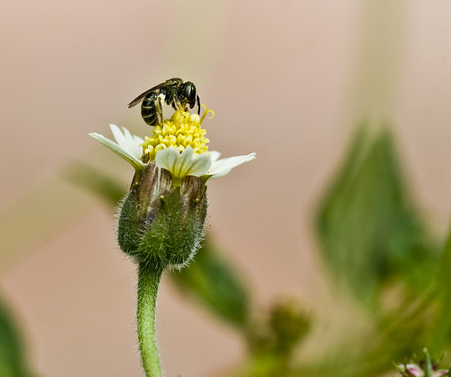

## Notes:

1. This repository includes the partial implementation of the 2PKNN algorithm.
Yashaswi Verma and C.V. Jawahar, Image Annotation Using Metric Learning in Semantic Neighbourhoods, ECCV 12. [[Link](https://link.springer.com/chapter/10.1007/978-3-642-33712-3_60)]

2. Also includes using the ImageNet pre-trained neural nets(RN101, DN169, DN161, VGG16) on [mirFlickr](https://press.liacs.nl/mirflickr/) dataset for feature extraction in Keras. Pre/post-processing conducted with scikit-learn.

## Instructions:

#### 1. Calculating Concept matrices
Run the ./AnotationMatrices/Concepts.ipynb file to create the Annotation Matrices. This results in two file with the 
names of "testAnnotationFlickr25k.mat" and "trainAnnotationFlickr25k.mat".

#### 2. Feature Extraction
2.1. Download pre-trained ImageNet weights for DenseNet161 and ResNet101 in the imagenet_models folder.
2.2. Run ./FeatureExtraction/feature_extraction.ipynb to extract feature. You might consider these changes:
* Method: can be set as either "5crops" or "pyramid". "5crops" crops 5 patches from the input image, and "pyramid" uses the "spatial pyramid pooling".
* ARCHITECTURE: you could use one of the following backbones: VGG16, DenseNet169, DenseNet161, ResNet101
* PCA_ENABLE: enable using PCA after feature extraction. You can change the variance retaining param in the related code-block.
* ROBUST_SCALAR_ENABLE: applies robust scalar to the data
* STANDARD_SCALAR_ENABLE: applies standard scalar to the data

#### 3. Classification based on 2pass KNN algorithm

Run the ./2PKNN_PYTHON/2PKNN_PYTHON.ipynb for classification.
* train and test: corresping to the .mat files for train and test features
* trainAnnotation and testAnnotation: corresponds to the matrices resulted from step 1.
* k: number of neighbors to consider

In the end of twopassknn2 function, some score will be saved which can be used in inference step.

#### 4. Inference

Place your desired images in the ./Inference/Img2Classify/ folder and use ./Inference/app.ipynb to classify it.

## Results for 5 Crops
| Architecture  | PCA | Robust_scalar | Standard_scalar | NC | Precision | Recall | F1 score | N+
| ----- | ------- | ----- | ------- | ----- | ------- | ----- | ------- | ----- |
| VGG16  | No  | No | No| 4096 | 0.54 | 0.46| 0.49 | 38 |
| VGG16  | No  | Yes | No| 4096 | 0.38 | 0.33| 0.35 | 37 |
| VGG16  | No  | No | Yes| 4096 | 0.56 | 0.44| 0.49 | 38 |
| VGG16  | Yes  | No | No| 2318 | 0.54 | 0.46| 0.50 | 38 |
| VGG16  | Yes | Yes | No| 2 | 0.20 | 0.20| 0.20 | 37 |
| VGG16  | Yes | No | Yes| 2496 | 0.56 | 0.44| 0.49 | 38 |
| DN169  | No  | No | No| 1664 | 0.27 | 0.26| 0.26 | 38 |
| DN169  | No  | Yes | No| 1664 | 0.31 | 0.25| 0.28 | 38 |
| DN169  | No  | No | Yes| 1664 | 0.31 | 0.26| 0.29 | 38 |
| DN169  | Yes  | No | No| 108 | 0.54 | 0.46| 0.50 | 38 |
| DN169  | Yes | Yes | No| 511 | 0.30 | 0.26| 0.28 | 38 |
| DN169  | Yes | No | Yes| 629 | 0.30 | 0.27| 0.29 | 38 |
| DN161  | No  | No | No| 2208 | 0.27 | 0.25| 0.26 | 38 |
| DN161  | No  | Yes | No| 2208 | 0.26 | 0.22| 0.24 | 38 |
| DN161  | No  | No | Yes| 2208 | 0.31 | 0.26| 0.28 | 38 |
| DN161  | Yes  | No | No| 140 | 0.27 | 0.25| 0.26 | 38 |
| DN161  | Yes | Yes | No| 188 | 0.25 | 0.23| 0.24 | 38 |
| DN161  | Yes | No | Yes| 798 | 0.30 | 0.26| 0.28 | 38 |
| RN101  | No  | No | No| 2048 | 0.51 | 0.39| 0.44 | 38 |
| RN101  | No  | Yes | No| 2048 | 0.56 | 0.39| 0.46 | 38 |
| RN101  | No  | No | Yes| 2048 | 0.55 | 0.39| 0.46 | 38 |
| RN101  | Yes  | No | No| 1009 | 0.50 | 0.39| 0.44 | 38 |
| RN101  | Yes | Yes | No| 1308 | 0.55 | 0.40| 0.46 | 38 |
| RN101  | Yes | No | Yes| 1416 | 0.55 | 0.39| 0.46 | 38 |

## Samples

* Actual labels: animals, flower, flower\_r1, plant_life
* Predicted labels: flower, plant\_life, flower_r1, tree, bird
